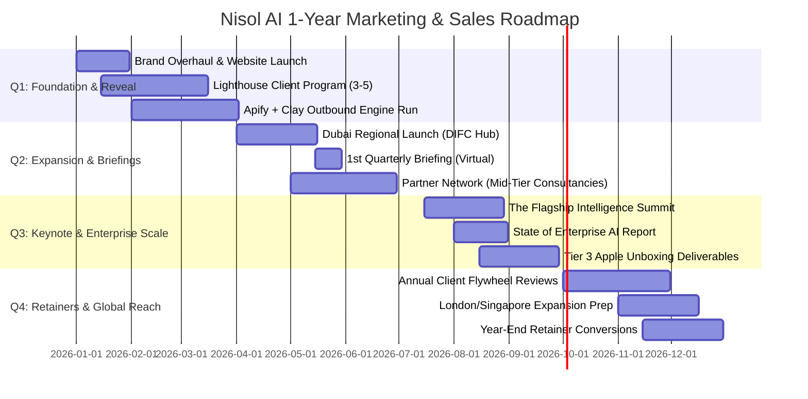

# 🍎 Apple CMO Master Strategy: Marketing & Sales Plan

> *"Marketing is about values. In a noisy world, we don't get a chance to get people to remember much about us. So we have to be extraordinarily clear about what we want them to know about us."*  
> — **Steve Jobs**

---

## Executive Summary & Vision

This master plan transforms **Nisol AI** from a traditional AI service provider into **the Apple of Enterprise Intelligence**. 

We do not sell "hours," "consulting," or "AI implementations." We sell **Enterprise Intelligence** — an operating system upgrade for how modern businesses think, decide, and compete.

By combining **Apple’s iconic brand gravity** (cinematic storytelling, radical simplicity, controlled scarcity, museum-grade deliverables) with an **invisible, data-driven revenue engine**, Nisol AI will capture and dominate enterprise accounts across India, the Middle East (Dubai), and global markets.

---

## Part 1: What Apple Includes in Their Plan (The CMO Playbook)

Apple's marketing plan is fundamentally different from traditional B2B playbooks. It is built on **8 core strategic pillars**:

```
┌─────────────────────────────────────────────────────────────────────────────┐
│                        THE APPLE CMO 8-PILLAR MODEL                         │
├─────────────────────────────────────────────────────────────────────────────┤
│ 1. Category Creation     │ Reposition from "Consulting" to "Intelligence OS"│
│ 2. Product Architecture  │ Three iconic products: Nisol One, Pro, Enterprise│
│ 3. Controlled Scarcity   │ "Apply for Discovery" (Only 5 enterprises/month) │
│ 4. Product IS Marketing  │ Deliverables so stunning they sell themselves    │
│ 5. Price as Signal       │ Zero discounts. Adjust scope, never quality.     │
│ 6. The Keynote Beat      │ Flagship annual Summit + Quarterly Briefings     │
│ 7. Ecosystem Lock-In     │ Flywheel: Discovery → Build → RoSense → Portal  │
│ 8. Invisible Engine      │ High-hustle outbound dressed in a brand tuxedo   │
└─────────────────────────────────────────────────────────────────────────────┘
```

### Pillar 1: Category Creation & Positioning
- **The Enemy:** The Big-4 consultancies who bill by the hour, send 40-person teams, take 6 months, and produce 200-page slide decks that gather dust.
- **The Brand Value:** Radical speed, uncompromised clarity, complete data sovereignty (zero vendor lock-in).
- **Core Tagline:** `Intelligence. Delivered.`
- **Brand Identity Statement:** *"Your enterprise has a thousand decisions. We make them intelligent."*

### Pillar 2: The Iconic Product Pyramid
We eliminate confusing service menus in favor of a clear, non-negotiable product hierarchy:

| Product Tier | Investment | Positioning & Outcome | Delivery Timeline |
| :--- | :--- | :--- | :--- |
| **Nisol Spark** | ₹1,50,000 ($1,800) | *The First Look:* Focused diagnostic (Cost Audit / DPDP Check) | 3 Days |
| **Nisol One** | ₹4,50,000 ($5,500) | *The Beginning:* Complete 15-capability diagnostic & 7-day roadmap | 7 Days |
| **Nisol Pro** | ₹8,50,000 ($10,500) | *The Transformation:* Full blueprint with DCF financial modeling & action briefs | 14 Days |
| **Nisol Enterprise** | ₹18,50,000+ ($22,500+) | *The Full Vision:* Enterprise intelligence architecture, governance & CoE setup | Multi-Week / Retainer |

### Pillar 3: Controlled Scarcity ("The Application Funnel")
- **No "Book a Free Call" buttons.** Free signals low value and desperation.
- **"Apply for Discovery":** Prospective clients submit an application answering company size, active AI mandates, and decision-maker involvement.
- **Monthly Cap:** Only 5 new enterprise engagements accepted per month per market.

### Pillar 4: Museum-Quality Deliverable Standard
Every report leaving Nisol AI follows Apple's hardware unboxing principles:
- **Digital:** Custom typography (SF Pro), interactive financial models, bespoke 3D radar maps.
- **Physical (Tier 2/3):** Cloth-bound, foil-stamped hardcover dossiers delivered in custom-embossed leather portfolio cases.
- **The Referral Engine:** A deliverable so impressive the CEO shows it to 3 other CEOs.

### Pillar 5: Non-Negotiable Pricing & Sales Rules
1. **Never Discount:** We adjust scope, not price or quality.
2. **Dubai / International Premium:** 40% premium pricing in UAE ($7,500 for Nisol One / $15,000 for Nisol Pro).
3. **No Hourly Billing:** Every price is outcome-anchored.

---

## Part 2: The 1-Year Master Strategic Plan (Q1 – Q4 Roadmap)



### Quarter 1: "The Reveal & Lighthouse Foundation"
*Theme: Establish Category & Land First Landmark Clients*

#### Marketing Directives:
- **Brand & Digital Overhaul:** Launch the simplified Apple-style website (`nisolai.com`) featuring emotional storytelling, minimal copy, and the *"Apply for Discovery"* application engine.
- **The Nisol Enterprise Intelligence Grant™ (First 60 Days):** Execute 2–3 selective "Grant Engagements" with high-prestige institutions (e.g., top university research centers or major impact foundations). This bypasses enterprise procurement drag, stress-tests the 7-day Discovery workflow, and generates unboxing video footage, photography, and unrestricted case studies.
- **Lighthouse Campaign:** Select top 20 enterprise accounts per key vertical (BFSI, Healthcare, Manufacturing). Offer 3–5 category-defining companies a **Co-Creation Partnership** (Nisol One at ₹2.5L in exchange for full case study rights, executive video testimonials, and board introductions).
- **Content Activation:** Launch LinkedIn executive thought leadership series: *"What If Your Enterprise Could Think?"*

#### Sales Directives:
- **Outbound Engine Activation:** Deploy background scraping (Apify/Fundoodata) targeting CXOs/CDOs/CIOs, enriched via Clay, executed via Instantly.ai with hyper-personalized, Apple-toned executive notes.
- **Pipeline Metric Targets:** 1,500 executive prospects contacted → 45 qualified applications → 12 Discovery sessions → **6 closed clients** (2 Grant Institutions + 4 Commercial Nisol One/Pro).
- **Target Q1 Revenue:** ₹32,00,000 ($38,500).

---

### Quarter 2: "The Inbound Engine & Regional Expansion"
*Theme: Regional Scaling & Community Magnetism*

#### Marketing Directives:
- **Dubai / Gulf Region Launch:** Establish DIFC presence. Launch dedicated UAE market messaging highlighting regional mandates (DUB.AI, Saudi Vision 2030) and USD pricing ($7.5k / $15k / $30k).
- **Q2 Executive Briefing:** Host the 1st **Quarterly Intelligence Briefing** — a 45-minute live cinematic presentation by Founder/CMO featuring real-life case studies from Q1 Lighthouse clients.
- **Partner Ecosystem:** Initiate co-marketing with mid-tier IT/consulting firms (RedSeer, Praxis, 50-200 person boutique integrators) who lack proprietary AI diagnostic capabilities.

#### Sales Directives:
- **Client Champion Kits:** Equip Q1 client CIOs/CDOs with presentation decks, board ROI one-pagers, and video clips to sell internal expansion.
- **Pipeline Metric Targets:** 2,000 outbound touches + inbound momentum → 60 applications → 18 Discovery sessions → **10 closed clients** (4 India + 4 Dubai + 2 Expansion Retainers).
- **Target Q2 Revenue:** ₹75,00,000 ($90,000).

---

### Quarter 3: "The Keynote Beat & Enterprise Scale"
*Theme: Flagship Event & Luxury Enterprise Positioning*

#### Marketing Directives:
- **The Flagship "Intelligence Summit":** Host an invite-only, 200-CXO event in Mumbai/Dubai. Format: 60-minute cinematic keynote, live on-stage RoSense AI demonstration, presentation of the *"State of Enterprise AI"* annual report.
- **Release Annual Report:** Publish a high-design, 40-page printed publication shipped directly to 500 hand-picked CEOs.
- **Unboxing Experience:** Roll out Tier 3 cloth-bound leather portfolio packages for all Enterprise-tier clients.

#### Sales Directives:
- **Conversion of Diagnostic to Build:** Transition 60% of Q1/Q2 Discovery clients into multi-month Build/Manage retainers (average deal size ₹25L–₹50L).
- **Pipeline Metric Targets:** 80 applications → 25 Discovery sessions → **14 closed clients** (6 Nisol Pro + 4 Nisol Enterprise + 4 Retainers).
- **Target Q3 Revenue:** ₹1,40,00,000 ($168,000).

---

### Quarter 4: "Global Dominance & Retainer Flywheel"
*Theme: Multi-National Footprint & Ecosystem Lock-In*

#### Marketing Directives:
- **Global Positioning:** Launch targeted campaigns into London and Singapore enterprise networks positioning Nisol AI as the premier global Enterprise Intelligence Architect.
- **Year-End ROI Campaign:** Campaign targeting CFOs: *"The Cost of Unused AI Budgets in 2026."*
- **Annual Re-assessment Activation:** Automate annual Discovery renewals for Q1/Q2 clients.

#### Sales Directives:
- **Retainer Lock-In:** Close 50% of annual client base into multi-year recurring Intelligence Advisory retainers (Nisol Genius Desk).
- **Pipeline Metric Targets:** 100 applications → 30 Discovery sessions → **16 closed clients / renewals**.
- **Target Q4 Revenue:** ₹2,10,00,000 ($250,000).

#### **Total Year 1 Revenue Goal:** **₹4.57 Crore (~$546,500)**

---

## Part 3: Platform-Wise 2-3 Month Granular Content Plan

This section provides a **90-Day Platform-Wise Content Matrix** designed to generate inbound authority, brand desire, and high-converting CXO lead applications.

```
┌─────────────────────────────────────────────────────────────────────────────┐
│                           PLATFORM STRATEGY MATRIX                          │
├─────────────────────────────────────────────────────────────────────────────┤
│ LinkedIn         │ Primary CXO Authority Engine (4 Posts / Week)            │
│ YouTube / Video  │ Cinematic Keynotes & Anti-Consulting Teardowns (2 / Month)│
│ CXO WhatsApp/Drop│ Direct VIP Executive Dossiers & Invitations (Bi-weekly)  │
│ Medium / Substack│ Deep-Dive "State of Enterprise AI" Papers (1 / Month)     │
└─────────────────────────────────────────────────────────────────────────────┘
```

### Platform 1: LinkedIn (The CXO & Thought Leadership Hub)
- **Target Audience:** CEOs, CIOs, CDOs, CFOs, VPs of Transformation.
- **Posting Frequency:** 4x per week (Mon, Tue, Thu, Fri at 8:30 AM IST / 9:00 AM GST).

#### 4 Strategic Content Pillars:
1. **The Macro Narrative (Mondays):** Challenging status quo, enterprise survival, value-based thinking.
2. **The Architectural Teardown (Tuesdays):** Visual breakdowns of failed AI projects vs. Nisol Intelligence architecture.
3. **The Proof Dossier (Thursdays):** Anonymized executive case studies, ROI metrics, delivery unboxing clips.
4. **The Apple CMO Philosophy (Fridays):** Provocative contrasts ("Big-4 vs. Nisol AI", "Hours vs. Outcomes").

---

### 90-Day Actionable Calendar Beat

#### **MONTH 1: "The Wake-Up Call" (Category Awareness & Distinction)**

| Week | Day | Platform | Pillar | Content Concept / Copy Angle | CTA / Asset |
| :--- | :--- | :--- | :--- | :--- | :--- |
| **W1** | Mon | LinkedIn | Macro Narrative | *"Most enterprises don't have an AI strategy. They have 14 expensive science projects."* | Read Whitepaper |
| | Tue | LinkedIn | Teardown | Infographic: The anatomy of a ₹1.2 Cr failed enterprise AI project. | Apply for Discovery |
| | Thu | LinkedIn | Proof Dossier | Case Study: How a manufacturing leader audited 62 AI capabilities in 7 days. | Link to Nisol One |
| | Fri | LinkedIn | Philosophy | *"Why we will never bill an enterprise by the hour."* | Comment / Share |
| | - | YouTube | Cinematic | **Video 1 (4 Min):** *"What If Your Enterprise Could Think?"* (Cinematic Brand Film) | Website Link |
| **W2** | Mon | LinkedIn | Macro Narrative | *"The CFO's dilemma: Spending millions on AI without knowing the DCF/NPV."* | Download Template |
| | Tue | LinkedIn | Teardown | Visual: Big-4 200-page slide deck vs. Nisol 7-Day Actionable Dossier. | Apply for Discovery |
| | Thu | LinkedIn | Proof Dossier | Carousel: 5 AI governance mistakes high-growth enterprises make under DPDP. | Download Brief |
| | Fri | LinkedIn | Philosophy | *"Controlled Scarcity: Why we only accept 5 enterprise partners per month."* | Application Link |
| **W3** | Mon | LinkedIn | Macro Narrative | *"Shadow AI is already inside your company. Here is what your CIO isn't seeing."* | Readiness Quiz |
| | Tue | LinkedIn | Teardown | Diagram: Centralized AI CoE vs. Fragmented Tooling. | Apply for Discovery |
| | Thu | LinkedIn | Proof Dossier | Unboxing Clip: Video showing the physical cloth-bound Nisol Pro dossier. | Watch Unboxing |
| | Fri | LinkedIn | Philosophy | *"Simplicity is the ultimate sophistication — even in enterprise AI architecture."* | Share Thoughts |
| | - | YouTube | Teardown | **Video 2 (6 Min):** *"Why 73% of Enterprise AI Projects Fail (And How to Fix It)"* | Channel Sub |
| **W4** | Mon | LinkedIn | Macro Narrative | *"AI is not a feature you add. It is an operating system upgrade for your business."* | Read Article |
| | Tue | LinkedIn | Teardown | Breakdown: Building vs. Buying Enterprise AI Infrastructure in 2026. | Apply for Discovery |
| | Thu | LinkedIn | Proof Dossier | Case Study: Reducing supply chain latency with RoSense AI agent network. | Download Dossier |
| | Fri | LinkedIn | Philosophy | *"We don't pitch. We listen, architect, and deliver."* | Application Link |

---

#### **MONTH 2: "The Dubai & Regional Scale" (Expanding Gravity)**

| Week | Day | Platform | Pillar | Content Concept / Copy Angle | CTA / Asset |
| :--- | :--- | :--- | :--- | :--- | :--- |
| **W5** | Mon | LinkedIn | Macro Narrative | *"Dubai AI Mandate: How Gulf enterprises are out-pacing global competitors."* | Middle East Report |
| | Tue | LinkedIn | Teardown | Visual: Legacy ERP vs. Autonomous Agent System Architecture. | Apply for Discovery |
| | Thu | LinkedIn | Proof Dossier | Case Study: Healthcare group AI audit resulting in $450k annual cost savings. | Read Case Study |
| | Fri | LinkedIn | Philosophy | *"Why enterprise software unboxing should feel like receiving an Apple product."* | View Photos |
| | - | YouTube | Keynote Prep | **Video 3 (8 Min):** *"Live Demo: Watch RoSense AI Ingest an Executive Meeting"* | Product Demo |
| **W6** | Mon | LinkedIn | Macro Narrative | *"The 3 questions every Board of Directors will ask their CEO about AI this quarter."* | Board Deck Guide |
| | Tue | LinkedIn | Teardown | Infographic: The 15 Capability Dimensions of Enterprise Intelligence. | Discovery Assessment |
| | Thu | LinkedIn | Proof Dossier | Client Quote: *"In 7 days, Nisol gave us more clarity than 6 months with consultants."* | Apply for Discovery |
| | Fri | LinkedIn | Philosophy | *"Zero Vendor Lock-in: Why you must own 100% of your code and vectors."* | Share Article |
| **W7** | Mon | LinkedIn | Macro Narrative | *"Stop building AI chatbots. Start building enterprise cognitive workflows."* | Download Playbook |
| | Tue | LinkedIn | Teardown | Architecture: Integrating LLMs securely with existing SQL enterprise databases. | Technical Brief |
| | Thu | LinkedIn | Proof Dossier | Case Study: BFSI client compliance automation under new data protection laws. | Download Case Study |
| | Fri | LinkedIn | Philosophy | *"Pricing as a Signal: Why quality has a non-negotiable floor."* | Application Link |
| | - | YouTube | Teardown | **Video 4 (5 Min):** *"The Anti-Consulting Manifesto: Outcome vs. Headcount"* | Subscribe |
| **W8** | Mon | LinkedIn | Macro Narrative | *"Announcement: Registration open for our 1st Quarterly Intelligence Briefing."* | Register VIP |
| | Tue | LinkedIn | Teardown | Teaser: 3 live enterprise AI architecture reveals happening at the Briefing. | Reserve Spot |
| | Thu | LinkedIn | Proof Dossier | Behind-the-Scenes: Preparing the physical dossiers for DIFC Dubai clients. | Apply for Discovery |
| | Fri | LinkedIn | Philosophy | *"Intelligence. Delivered. What those two words mean to our team."* | Briefing Registration|

---

#### **MONTH 3: "The Conversion & Keynote Wave" (Authority Lock-In)**

| Week | Day | Platform | Pillar | Content Concept / Copy Angle | CTA / Asset |
| :--- | :--- | :--- | :--- | :--- | :--- |
| **W9** | Mon | LinkedIn | Macro Narrative | *"Live Event Beat: Highlights from the 1st Quarterly Intelligence Briefing."* | Watch Recording |
| | Tue | LinkedIn | Teardown | Release: The Enterprise Intelligence Maturity Index 2026. | Download Index |
| | Thu | LinkedIn | Proof Dossier | Case Study: Retail empire achieving 12x ROI with Nisol Pro roadmap. | Read Full Study |
| | Fri | LinkedIn | Philosophy | *"Partnership over vendor status: How we work side-by-side with your CIO."* | Apply for Discovery |
| | - | YouTube | Keynote | **Video 5 (15 Min):** *"State of Enterprise AI 2026 — Keynote Stream"* | Full Keynote |
| **W10**| Mon | LinkedIn | Macro Narrative | *"Why 2026 is the year of the Autonomous Agent in enterprise operations."* | Download Guide |
| | Tue | LinkedIn | Teardown | Comparison: Custom RAG vs. Fine-tuned Models vs. Hybrid Agent Mesh. | Tech Whitepaper |
| | Thu | LinkedIn | Proof Dossier | Client Video Clip: CEO discussing the board meeting presentation after Nisol One. | Apply for Discovery |
| | Fri | LinkedIn | Philosophy | *"The 5-Partner Limit: Why we turned down 3 inquiries this week."* | Reserve Next Month |
| **W11**| Mon | LinkedIn | Macro Narrative | *"The hidden cost of waiting: What 6 months of AI delay costs a $50M company."* | Calculate ROI |
| | Tue | LinkedIn | Teardown | Visual Framework: The 4-Gate Decision Protocol for Enterprise AI Projects. | Download Protocol |
| | Thu | LinkedIn | Proof Dossier | Case Study: Logistics enterprise automating 80% of dispatch routing logic. | Read Case Study |
| | Fri | LinkedIn | Philosophy | *"Why your company's data architecture is your only true competitive moat."* | Share Post |
| | - | YouTube | Teardown | **Video 6 (7 Min):** *"Inside an Nisol AI Discovery Week: Day 1 to Day 7"* | Behind the Scenes |
| **W12**| Mon | LinkedIn | Macro Narrative | *"Q3 Applications Closing: Opening seats for the upcoming enterprise cohort."* | Apply Now |
| | Tue | LinkedIn | Teardown | Infographic: The Enterprise Intelligence OS Stack breakdown. | Apply for Discovery |
| | Thu | LinkedIn | Proof Dossier | Quarterly Impact Summary: $3.2M in ROI created for Nisol partners in Q2. | View Dossier |
| | Fri | LinkedIn | Philosophy | *"Looking ahead: The future of enterprise intelligence."* | Application Link |

---

### Platform 2: Direct CXO Outreach & Executive VIP Drops (WhatsApp & Email)

For Tier-1 Enterprise Accounts (Top 100 CEOs/CIOs in India & Dubai), social media is supported by **Apple-Grade Direct Touches**:

```
┌─────────────────────────────────────────────────────────────────────────────┐
│                       EXECUTIVE DIRECT OUTREACH SEQUENCE                    │
├─────────────────────────────────────────────────────────────────────────────┤
│ Step 1: Personal Video Message (Loom/Custom) from Founder                   │
│         "We analyzed your industry's top 3 AI bottlenecks. Here is 60 sec." │
│                                                                             │
│ Step 2: Physical Gift Courier (Tier 2 Packaging)                            │
│         Hand-delivered custom leather bound "Industry AI Intelligence Brief" │
│                                                                             │
│ Step 3: VIP Executive WhatsApp Note                                         │
│         "Sent a physical dossier to your office. Would love 15 mins to hear  │
│          if your board's priority aligns with Page 4."                      │
└─────────────────────────────────────────────────────────────────────────────┘
```

---

## Part 4: Sales Architecture & Metric Dashboard

To ensure Apple-grade execution, we track sales velocity through a streamlined conversion model:

```
┌─────────────────────────────────────────────────────────────────────────┐
│                       MONTHLY CONVERSION TARGETS                        │
├─────────────────────────────────────────────────────────────────────────┤
│ Executive Impressions (LinkedIn/YouTube/Media):     150,000+            │
│ Target Account Outbound Touches (Clay/Instantly):   500                 │
│ Inbound / Outbound Applications Received:           25–30               │
│ Qualified Discovery Conversations Held:             8–10                │
│ Nisol One / Pro / Enterprise Contracts Signed:       4–5                 │
│ Client Conversion Rate (Application → Client):      15%–20%             │
└─────────────────────────────────────────────────────────────────────────┘
```

---

## Summary Checklist for Immediate Execution

1. **Website Transformation:** Update homepage to Apple aesthetic (radically simple hero, *"Apply for Discovery"* CTA).
2. **Deploy Nisol Product Architecture:** Standardize proposals to **Spark, One, Pro, Enterprise**.
3. **Packaging Production:** Order initial batch of custom leather embossed folders and cloth-bound dossier covers.
4. **Launch LinkedIn Campaign:** Execute Month 1 content calendar starting Monday.
5. **Activate Outbound Engine:** Launch targeted Clay + Instantly cadence for Lighthouse prospects.
