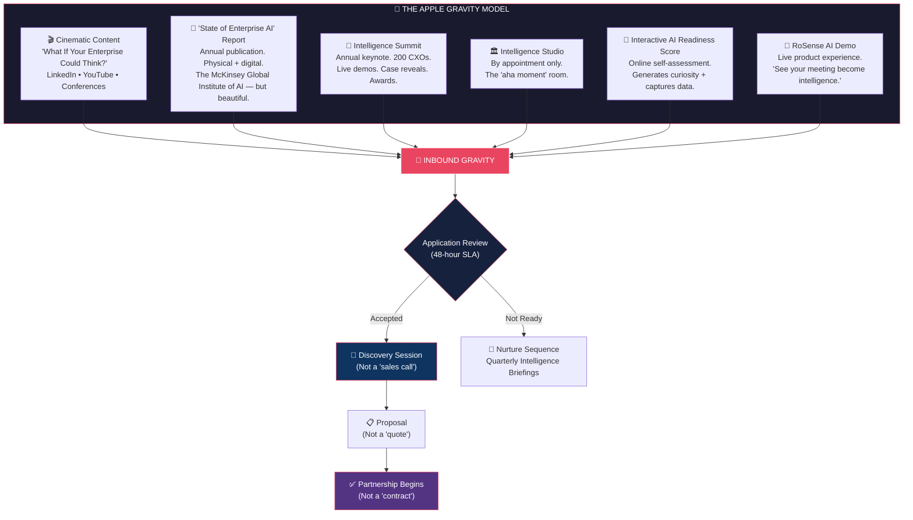

# 🍎 What If Apple Owned Nisol AI?

## A Strategic Reimagination of Enterprise AI Sales & Marketing

---

> *"People don't know what they want until you show it to them."*
> — Steve Jobs

> *"Marketing is about values. It's a very complicated world; it's a very noisy world. And we're not going to get a chance to get people to remember much about us. So we have to be really clear about what we want them to know about us."*
> — Steve Jobs, "Think Different" internal launch, 1997

---

## The Core Problem With How AI Consulting Is Sold Today

Every AI consulting firm in India and Dubai pitches the same way:

```
❌  "We offer AI/ML consulting, data engineering, and GenAI solutions..."
❌  "Our team has 50+ years of combined experience..."
❌  "We serve BFSI, Healthcare, Manufacturing, and Retail..."
❌  "Contact us for a free consultation..."
```

This is the equivalent of Dell selling computers by listing processor speeds and RAM.

**Apple never sold a computer by its specs. Apple sold what you could BECOME.**

If Apple owned Nisol AI, they would fundamentally reject the entire premise of "selling AI consulting services." They wouldn't pitch. They wouldn't chase. They wouldn't discount. They wouldn't even use the word "consulting."

They would **create something so magnetic, so beautifully clear, so obviously superior** that the world would come to them.

---

## The 10 Apple Principles Applied to Nisol AI

---

### Principle 1: Kill the Category. Create a New One.

**What everyone else does:** "We are an AI consulting company."

**What Apple would do:** Refuse to be categorized.

Apple didn't sell "MP3 players" — they sold the **iPod**.
Apple didn't sell "smartphones" — they sold the **iPhone**.
Apple didn't sell "tablets" — they sold the **iPad**.

> [!IMPORTANT]
> **Apple would never call Nisol AI an "AI consulting company."**
> They would position it as **the world's first Enterprise Intelligence System™.**

#### The Repositioning:

```
┌─────────────────────────────────────────────────────────────────────────┐
│                                                                         │
│    BEFORE (Industry Default)          AFTER (Apple Thinking)            │
│                                                                         │
│    "AI Consulting Company"    →    "Enterprise Intelligence Partner"    │
│    "We build AI solutions"    →    "We make enterprises think"         │
│    "Hire our AI experts"      →    "Intelligence. Delivered."          │
│    "Book a free consultation" →    "Apply for a Discovery Session"     │
│    "Our services include..."  →    "One system. Every answer."         │
│                                                                         │
└─────────────────────────────────────────────────────────────────────────┘
```

The tagline wouldn't be a feature list. It would be a **belief statement:**

> # *"Intelligence. Delivered."*

or

> # *"Think Faster."*

or

> # *"Your Enterprise, Awakened."*

Three words. No jargon. No "leveraging synergies." No "cutting-edge AI solutions."

Just a **promise of transformation**.

---

### Principle 2: The Product IS the Marketing

Apple spends less on advertising per dollar of revenue than Samsung, Google, or Microsoft. Their products market themselves because they are **obsessively, unreasonably excellent**.

**Applied to Nisol AI:**

Apple would take the Nisol Discovery™ Framework and make it so breathtakingly beautiful, so meticulously designed, that every executive who receives the deliverable **shows it to 5 other executives**.

```
┌──────────────────────────────────────────────────────────────────────┐
│                                                                      │
│   THE DELIVERABLE IS THE MARKETING                                   │
│                                                                      │
│   Every board-ready report that leaves Nisol AI should be so         │
│   visually stunning, so strategically sharp, so unlike anything      │
│   McKinsey or Accenture produces, that the CEO who receives it       │
│   says: "Who made this? I need to introduce them to my board."       │
│                                                                      │
│   That single moment — the moment the deliverable sells itself —     │
│   is worth more than 10,000 cold emails.                             │
│                                                                      │
└──────────────────────────────────────────────────────────────────────┘
```

**Specific Apple-grade deliverable standards:**

| Element | Current State | Apple Standard |
| :--- | :--- | :--- |
| **Report Design** | Professional PDF | Museum-quality publication. Custom typography (SF Pro / Söhne). Cloth-bound physical copy hand-delivered to the CEO. |
| **Data Visualization** | Charts & graphs | Interactive 3D radar charts, animated maturity curves, touch-responsive on iPad. Like a Bloomberg Terminal meets Jony Ive. |
| **Packaging** | Email attachment | Physical delivery in a custom-embossed Nisol AI portfolio case. Unboxing experience. The report arrives like an Apple product. |
| **Presentation** | Slide deck | A **cinematic experience**. Dimmed lights. 60-inch screen. A single presenter. No bullet points. One idea per slide. Silence between transitions. |

---

### Principle 3: Simplify Everything Until It Hurts

Apple's homepage for the iPhone 16 didn't list 47 features. It said:

> **"Hello, Apple Intelligence."**

That's it.

**Applied to Nisol AI's website and pitch:**

Current state (industry default):
```
"Nisol AI offers end-to-end AI strategy & discovery, autonomous AI agents, 
AI engineering & DevOps, enterprise AI assistants, AI-powered automation, 
and data readiness services across BFSI, Healthcare, Manufacturing..."
```

**Apple would rewrite it as:**

```
                    ┌──────────────────────────────┐
                    │                              │
                    │     Your enterprise has       │
                    │     a thousand decisions.     │
                    │                              │
                    │     We make them              │
                    │     intelligent.              │
                    │                              │
                    │     ───────────────           │
                    │                              │
                    │     [ Apply for Discovery ]   │
                    │                              │
                    └──────────────────────────────┘
```

**No service list. No feature grid. No "our team has X years of experience."**

Just the **emotional truth** of what you're buying: **clarity in a world of noise.**

---

### Principle 4: Three Products. Not Thirty.

Apple sells 4 iPhones a year. Not 47 SKUs like Samsung.

**Applied to Nisol AI — The Product Pyramid:**

Apple would collapse Nisol AI's complex service matrix into **three iconic, named products:**

```
                         ╔══════════════════════╗
                         ║                      ║
                         ║   NISOL ENTERPRISE   ║
                         ║   ₹18,50,000+        ║
                         ║   "The Full Vision"   ║
                         ║                      ║
                    ╔════╩══════════════════════╩════╗
                    ║                                ║
                    ║        NISOL PRO               ║
                    ║        ₹8,50,000               ║
                    ║        "The Transformation"     ║
                    ║                                ║
               ╔════╩════════════════════════════════╩════╗
               ║                                          ║
               ║           NISOL ONE                      ║
               ║           ₹4,50,000                      ║
               ║           "The Beginning"                 ║
               ║                                          ║
               ╚══════════════════════════════════════════╝
```

| Product | One-Line Description | Apple Parallel |
| :--- | :--- | :--- |
| **Nisol One** | Everything your enterprise needs to see its AI future — in 7 days. | iPhone SE — the essential, no-compromise entry point |
| **Nisol Pro** | The complete transformation blueprint with financial modeling and change management. | iPhone Pro — for those who demand more |
| **Nisol Enterprise** | Your organization's entire AI nervous system — architected, governed, and activated. | iPhone Pro Max — the ultimate expression |

**Notice:** No confusing "Foundation Diagnostic" or "Growth Transformation" labels. Just **One. Pro. Enterprise.** Everyone understands the hierarchy instantly. Apple made this work for $1,000+ phones. It works for ₹4.5L+ engagements.

---

### Principle 5: Controlled Scarcity — Make Them Apply, Not "Enquire"

Apple doesn't beg you to buy. They create **controlled scarcity and aspiration**.

- iPhone launch: Lines around the block. Limited stock.
- Apple Card: "Apply and see if you're approved."
- Apple Developer Program: "Apply for membership."

**Applied to Nisol AI:**

> [!CAUTION]
> **Apple would NEVER have a "Book a Free Consultation" button.**
> Free = no value. Free = desperation. Free = commodity.

Instead:

```
┌─────────────────────────────────────────────────────────────────┐
│                                                                 │
│   "We partner with 5 new enterprises each month.               │
│    Apply for a Discovery Session to see if we're the           │
│    right fit for your organization."                            │
│                                                                 │
│              [ Apply for Discovery → ]                          │
│                                                                 │
│   "Applications reviewed within 48 hours.                      │
│    Priority given to enterprises with active AI mandates."      │
│                                                                 │
└─────────────────────────────────────────────────────────────────┘
```

**What this does psychologically:**
- Flips the power dynamic: YOU are choosing THEM, not begging for their business
- Creates urgency: "Only 5 per month" — I better apply now
- Signals premium: If they're selective, they must be exceptional
- Qualifies leads automatically: Only serious enterprises apply
- Eliminates tire-kickers: No more wasted calls with people who "just want to learn about AI"

---

### Principle 6: The Keynote — Make Every Launch an Event

Apple's most powerful marketing tool isn't an ad. It's the **keynote.**

2 million people watch Apple keynotes live. Every tech publication covers it. The product sells itself through **theatre, storytelling, and revelation**.

**Applied to Nisol AI — "The Intelligence Summit"**

```
┌──────────────────────────────────────────────────────────────────────┐
│                                                                      │
│                    THE NISOL INTELLIGENCE SUMMIT                      │
│                    ─────────────────────────────                      │
│                                                                      │
│   An annual flagship event where Nisol AI reveals:                   │
│                                                                      │
│   🎯  New product capabilities and methodology updates               │
│   📊  Live, on-stage enterprise transformation case studies           │
│   🤖  RoSense AI live demo — ingesting a real meeting on stage       │
│   📈  "State of Enterprise AI" annual report release                 │
│   🏆  "Enterprise Intelligence Awards" — honoring transformative     │
│       leaders among Nisol AI's client base                           │
│                                                                      │
│   Format: Invite-only. 200 CXOs. Cinematic production.              │
│   Locations: Mumbai (Year 1) → Dubai (Year 2) → Bangalore (Year 3)  │
│                                                                      │
│   Every attendee receives a physical copy of Nisol AI's              │
│   "State of Enterprise AI" report — a publication so beautifully     │
│   designed it sits on coffee tables, not in desk drawers.            │
│                                                                      │
└──────────────────────────────────────────────────────────────────────┘
```

**Additionally — Quarterly "Intelligence Briefings":**

Instead of generic webinars, Apple would host **quarterly invite-only Intelligence Briefings** — 45-minute cinematic presentations (think WWDC sessions) where Ssooraj presents ONE big idea with zero slides, just live demos and narrative.

These get recorded, edited to Apple production quality, and released on YouTube/LinkedIn. They become the content engine.

---

### Principle 7: Advertising That Moves Souls, Not Features

Apple's most iconic ads sell **feelings**, not specifications.

| Apple Ad | What It Sold | What It ACTUALLY Sold |
| :--- | :--- | :--- |
| "Think Different" (1997) | Macintosh computers | **Identity.** "You are a creative rebel." |
| "1,000 Songs in Your Pocket" (2001) | iPod (5GB storage) | **Freedom.** Your entire music library, everywhere. |
| "What's a Computer?" (2017) | iPad Pro | **The future.** Post-PC identity. |
| "Privacy. That's iPhone." (2019) | iPhone security features | **Trust.** "We protect what matters." |

**Applied to Nisol AI — Campaign Concepts:**

---

#### Campaign 1: "What If Your Enterprise Could Think?"

A 60-second cinematic film. No voiceover for the first 40 seconds.

```
[VISUAL: A massive enterprise — factory floor, trading desk, hospital 
corridor, logistics warehouse. Everything moving. Everyone busy. 
But something is missing.]

[TEXT ON SCREEN: "Your enterprise moves fast."]

[VISUAL: Decisions being made on gut instinct. Spreadsheets. Meetings 
about meetings. A CEO staring at conflicting reports.]

[TEXT ON SCREEN: "But does it think?"]

[VISUAL: A transformation. The same scenes, but now augmented. An AI 
agent surfacing the right answer before the question is asked. A board 
room where the strategy is crystal clear. A factory where downtime is 
predicted before it happens.]

[TEXT ON SCREEN: "Intelligence. Delivered."]

[NISOL AI LOGO]

[TEXT ON SCREEN: "Apply for Discovery. nisolai.com"]
```

**Where this runs:** LinkedIn Sponsored (targeted at C-suite in target verticals + cities), YouTube pre-roll, conference screens.

---

#### Campaign 2: "The Cost of Not Knowing"

A print/digital series. Each ad is a single, devastating statistic:

```
┌──────────────────────────────────────────────────────┐
│                                                      │
│     "73% of enterprise AI projects fail              │
│      before reaching production."                    │
│                                                      │
│      Yours won't.                                    │
│                                                      │
│      ─────────                                       │
│      Nisol AI                                        │
│      Intelligence. Delivered.                        │
│                                                      │
└──────────────────────────────────────────────────────┘

┌──────────────────────────────────────────────────────┐
│                                                      │
│     "The average enterprise wastes ₹1.2 Crore        │
│      on AI initiatives that never ship."             │
│                                                      │
│      We ship in 7 days.                              │
│                                                      │
│      ─────────                                       │
│      Nisol AI                                        │
│      Intelligence. Delivered.                        │
│                                                      │
└──────────────────────────────────────────────────────┘
```

---

#### Campaign 3: "Built Different" — The Anti-Consulting Campaign

Apple famously positioned the Mac against PCs ("I'm a Mac, I'm a PC"). Nisol AI positions against Big-4 consultancies:

```
┌─────────────────────────────────────────────────────────────────┐
│                                                                 │
│          They send you               We send you                │
│          a 47-person team.           a 2-person pod.            │
│                                                                 │
│          They bill by the hour.      We bill by the outcome.    │
│                                                                 │
│          They take 6 months.         We take 7 days.            │
│                                                                 │
│          They lock you in.           We set you free.           │
│                                                                 │
│                                                                 │
│          ─────────                                              │
│          Nisol AI                                                │
│          Built Different.                                        │
│                                                                 │
└─────────────────────────────────────────────────────────────────┘
```

---

### Principle 8: The Apple Store Experience → "Nisol Intelligence Studio"

Apple's retail stores aren't shops. They're **temples of the brand**. You walk in, experience the products, attend workshops, and talk to Geniuses. You leave **believing**.

**Applied to Nisol AI — The Intelligence Studio:**

Apple wouldn't have Nisol AI doing cold outreach from a home office. They would create a **physical-digital brand experience**.

```
┌──────────────────────────────────────────────────────────────────────┐
│                                                                      │
│              THE NISOL INTELLIGENCE STUDIO                           │
│              ────────────────────────────                             │
│                                                                      │
│   A premium, appointment-only experience space in:                   │
│   📍 Mumbai (BKC) | 📍 Bangalore (Koramangala) | 📍 Dubai (DIFC)    │
│                                                                      │
│   Not an office. An EXPERIENCE.                                      │
│                                                                      │
│   ┌────────────────────────────────────────────────────────────┐     │
│   │ DISCOVERY ROOM                                             │     │
│   │ • 85" interactive display wall                             │     │
│   │ • Live RoSense AI demo ingesting a real meeting            │     │
│   │ • Real-time AI Readiness Score generation                  │     │
│   │ • The "aha moment" happens here                            │     │
│   └────────────────────────────────────────────────────────────┘     │
│                                                                      │
│   ┌────────────────────────────────────────────────────────────┐     │
│   │ GALLERY OF INTELLIGENCE                                    │     │
│   │ • Physical display of past deliverables (anonymized)       │     │
│   │ • Before/after transformation stories on screens           │     │
│   │ • Interactive touch-screen case study exploration           │     │
│   └────────────────────────────────────────────────────────────┘     │
│                                                                      │
│   ┌────────────────────────────────────────────────────────────┐     │
│   │ THE GENIUS DESK (Post-Sale)                                │     │
│   │ • Ongoing advisory sessions for existing clients           │     │
│   │ • Quarterly intelligence reviews                           │     │
│   │ • The "AppleCare" of enterprise AI                         │     │
│   └────────────────────────────────────────────────────────────┘     │
│                                                                      │
│   Walk-ins: None. By appointment only.                               │
│   Every visitor is a potential ₹8.5L+ client.                        │
│                                                                      │
└──────────────────────────────────────────────────────────────────────┘
```

> [!TIP]
> **Phase 1 Reality:** You don't need a physical studio on Day 1. Start with a **premium co-working meeting room** (WeWork Private Office / Cowrks in BKC / Awfis in Koramangala) that you brand as "The Intelligence Studio" for client meetings. The experience IS the brand — not the square footage.

---

### Principle 9: Global Positioning from Day 1 — Not City by City

Apple doesn't launch the iPhone in Cupertino first, then expand to New York, then Tokyo. They launch **simultaneously worldwide**. The message is: "We are a global company. We were always a global company."

**Applied to Nisol AI — The Global Pitch:**

```
┌──────────────────────────────────────────────────────────────────────┐
│                                                                      │
│   Apple would NEVER say:                                             │
│   "We serve clients in Mumbai, Bangalore, and Dubai."               │
│                                                                      │
│   Apple WOULD say:                                                   │
│   "We partner with enterprises that are ready to think differently   │
│    about intelligence. Wherever they are."                           │
│                                                                      │
│   The website would show:                                            │
│   🌏 A world map with dots in Mumbai, Dubai, Bangalore, London,     │
│      Singapore — even if you only have 3 clients.                   │
│      The ASPIRATION is global. The perception is global.             │
│                                                                      │
│   Pricing would be in:                                               │
│   💰 USD globally (not INR) — because a global company prices        │
│      in the global currency. India clients see INR equivalent.       │
│                                                                      │
│   The language would be:                                             │
│   🗣️ "Enterprises across Asia, the Middle East, and beyond trust     │
│       Nisol AI to architect their intelligence infrastructure."      │
│                                                                      │
└──────────────────────────────────────────────────────────────────────┘
```

**The pitch to the world wouldn't mention geography at all.** It would say:

> *"Every enterprise in the world will need an AI nervous system in the next 3 years. Most will waste 18 months and millions figuring it out the hard way. A few will call us first."*

---

### Principle 10: Price Is a Signal. Never Apologize for It.

Apple has NEVER had a sale. Never a Black Friday discount. Never a "limited time offer." The price is the price because **the product is worth it**.

**Applied to Nisol AI:**

```
┌──────────────────────────────────────────────────────────────────────┐
│                                                                      │
│   THE APPLE PRICING COMMANDMENTS FOR NISOL AI:                      │
│                                                                      │
│   1. Never discount. Ever. Not for "big clients." Not for           │
│      "strategic accounts." Not for "future potential."               │
│      The price is the price.                                         │
│                                                                      │
│   2. Never say "starting from ₹4,50,000."                           │
│      Say "Nisol One: ₹4,50,000." (Period. No "starting from.")      │
│                                                                      │
│   3. Never justify the price with hours or headcount.                │
│      "You're not paying for 7 days of consulting.                    │
│       You're paying for 24 years of knowing exactly                  │
│       what to look for — delivered in 7 days."                       │
│                                                                      │
│   4. If a prospect asks for a discount, the answer is:               │
│      "We can absolutely adjust the scope to fit your budget.         │
│       But we don't adjust the quality."                              │
│                                                                      │
│   5. Dubai pricing: 40% premium over India.                          │
│      Not because it costs more to deliver.                           │
│      Because the market expects premium = better.                    │
│      Nisol One (Dubai): $7,500 | Nisol Pro (Dubai): $15,000         │
│                                                                      │
└──────────────────────────────────────────────────────────────────────┘
```

---

## How Apple Would Structure the Global Sales Machine

### The Anti-Outbound: Inbound Gravity

Apple doesn't cold-call anyone. Apple creates **gravity** — a force so strong that customers are pulled toward them.



### The Language Shift — Words Apple Would NEVER Use vs. ALWAYS Use

| ❌ NEVER Say (Commodity Language) | ✅ ALWAYS Say (Apple Language) |
| :--- | :--- |
| "Client" | **"Partner"** |
| "Project" | **"Engagement"** or **"Transformation"** |
| "Contract" | **"Partnership Agreement"** |
| "Deliverable" | **"Intelligence Report"** or **"Dossier"** |
| "Consulting" | **"Architecture"** or **"Design"** |
| "Sales call" | **"Discovery Session"** |
| "Free consultation" | **"Apply for Discovery"** |
| "Proposal" | **"Engagement Blueprint"** |
| "Invoice" | **"Investment Summary"** |
| "Our competitors" | Never acknowledge they exist |
| "Discount" | **"We can adjust scope"** |
| "Cheap" or "Affordable" | **"Accessible"** or simply state the price |
| "We can also do X, Y, Z" | **"We do three things. Perfectly."** |

---

## The Apple Pitch to the World

If Ssooraj walked onto a stage at GITEX Global or NASSCOM AI Summit, and pitched Nisol AI the Apple way, the entire presentation would be **5 minutes**. Not 30. Not 60. Five.

Here's the script:

---

```
[Stage is dark. Single spotlight. Ssooraj walks out. No slides behind him.]

"Every enterprise in the world is about to face the same question.

Not 'Should we use AI?' That question was answered two years ago.

The question is: 'How do we make our entire organization intelligent — 
without wasting 18 months and two crore rupees figuring it out?'

[Pause]

Most companies will hire a big consulting firm. They'll get a 47-person 
team, a 6-month timeline, and a 200-page report that sits in a drawer.

We do something different.

[First slide appears: "7 DAYS"]

We send two senior architects into your organization. In 7 days, they 
interview every department leader, audit your data infrastructure, map 
62 capability dimensions, and deliver a board-ready transformation 
strategy that your CFO can take to the board on Monday morning.

Not a deck. A DOSSIER.

[Shows physical Nisol AI dossier — beautifully designed, cloth-bound]

And when you're ready to build, we don't lock you in. Every line of 
code, every vector embedding, every model — it's yours. Forever. 
Zero vendor lock-in.

[Second slide: "INTELLIGENCE. DELIVERED."]

We partner with 5 new enterprises each month.

If your organization is ready to think faster, apply at nisolai.com.

[Walks off stage. Total time: 4 minutes 30 seconds.]
```

---

> [!IMPORTANT]
> **Notice what's NOT in this pitch:**
> - No feature lists
> - No technology name-dropping (no "LangChain," "RAG," "GPT-4")
> - No "our team has X years of experience"
> - No competitor bashing
> - No pricing (price is on the website — if you have to ask, it's for you)
> - No desperation ("We'd love to work with you!")
> 
> **What IS in this pitch:**
> - A universal truth (every enterprise needs this)
> - A villain (the Big-4 waste your time and money)
> - A hero (Nisol AI — speed, quality, freedom)
> - A constraint (only 5/month — you better move)
> - A call to action (apply, don't "enquire")

---

## The Ecosystem Flywheel — How Apple Creates Lock-In Through Excellence

Apple doesn't lock you in with contracts. They lock you in because **everything works together so beautifully** that leaving feels like a downgrade.

**Applied to Nisol AI — The Intelligence Ecosystem:**

```
                    ┌─────────────────────┐
                    │                     │
                    │   NISOL DISCOVERY™  │
                    │   (The Assessment)  │
                    │                     │
                    └────────┬────────────┘
                             │
                 ┌───────────┼───────────┐
                 ▼           ▼           ▼
        ┌────────────┐ ┌──────────┐ ┌────────────┐
        │            │ │          │ │            │
        │   BUILD    │ │  MANAGE  │ │  MONITOR   │
        │            │ │          │ │            │
        └──────┬─────┘ └────┬─────┘ └─────┬──────┘
               │            │             │
               └────────────┼─────────────┘
                            ▼
                 ┌──────────────────────┐
                 │                      │
                 │   ROSENSE AI         │
                 │   (Always Listening, │
                 │    Always Learning)  │
                 │                      │
                 └──────────┬───────────┘
                            │
                            ▼
                 ┌──────────────────────┐
                 │                      │
                 │   NISOL PORTAL       │
                 │   (The Dashboard)    │
                 │   AI Health Score    │
                 │   Model Performance  │
                 │   Cost Tracking      │
                 │   Governance Alerts  │
                 │                      │
                 └──────────┬───────────┘
                            │
                            ▼
                 ┌──────────────────────┐
                 │                      │
                 │   QUARTERLY          │
                 │   INTELLIGENCE       │
                 │   REVIEW             │
                 │   (The Genius Desk)  │
                 │                      │
                 └──────────┬───────────┘
                            │
                            ▼
                    Back to DISCOVERY
                    (Annual Reassessment)
```

**The flywheel:** Discovery → Build/Manage/Monitor → RoSense → Portal → Quarterly Review → New Discovery needs identified → Expand scope → Repeat.

**Apple's genius:** You never "finish" being an Apple customer. You're always in the ecosystem. Nisol AI should create the same gravitational pull — once you've done Discovery, you naturally need Build, then Monitor, then the Portal, then Quarterly Reviews, then a new Discovery cycle as your business evolves.

---

## Summary: The Fundamental Mindset Shift

```
┌──────────────────────────────────────────────────────────────────────┐
│                                                                      │
│   THE CURRENT APPROACH              THE APPLE APPROACH               │
│   ─────────────────────             ──────────────────               │
│                                                                      │
│   Chase 500 leads/month    →    Create gravity. Let 50 apply.       │
│   Cold email sequences     →    Cinematic content + referrals.      │
│   "Book a free call"       →    "Apply for Discovery."             │
│   List 6 service pillars   →    "Three products. Perfectly."       │
│   Price justification      →    Price is a signal of quality.      │
│   Feature comparisons      →    "We make enterprises think."       │
│   City-by-city expansion   →    "We serve the world."              │
│   Discounts for big deals  →    "We adjust scope, not quality."    │
│   PowerPoint proposals     →    Cinematic, physical dossiers.      │
│   Webinars                 →    Intelligence Summits.              │
│   Office                   →    Intelligence Studio.               │
│   Clients                  →    Partners.                          │
│   Sell harder              →    Build better.                      │
│                                                                      │
│   THE BOTTOM LINE:                                                   │
│   Apple doesn't sell products. Apple sells IDENTITY.                │
│   Nisol AI shouldn't sell consulting. Nisol AI should sell          │
│   INTELLIGENCE — and the identity of being an enterprise           │
│   that thinks faster than everyone else.                            │
│                                                                      │
└──────────────────────────────────────────────────────────────────────┘
```

---

## User Review Required

> [!IMPORTANT]
> **This Apple-style strategy represents a fundamentally different philosophy from the outbound-heavy plan in the original implementation plan.** The two approaches are not mutually exclusive — but they require different resource allocation:
>
> 1. **Hybrid approach (Recommended):** Use the **Apify outbound engine from the original plan** to drive volume in Months 1–6, while simultaneously building the **Apple gravity assets** (cinematic content, Intelligence Summit, Studio experience, application-based funnel). By Month 7–9, shift the ratio from 80% outbound / 20% inbound gravity to 50/50, and by Month 12, target 30% outbound / 70% inbound gravity.
>
> 2. **Pure Apple approach:** Invest heavily upfront in brand, content, and experience. Slower start (2–3 clients/month for first 6 months) but compounds exponentially. Requires higher initial capital for production-quality content and event execution.
>
> 3. **Which product naming do you prefer?** Current (Foundation / Growth / Enterprise) or Apple-style (Nisol One / Nisol Pro / Nisol Enterprise)?
>
> 4. **Should we redesign the nisolai.com website** to reflect the Apple aesthetic — radical simplicity, emotional messaging, "Apply for Discovery" CTA?
>
> 5. **Physical deliverable experience:** Should we explore premium packaging (cloth-bound reports, embossed portfolio cases) for high-ticket engagements?
