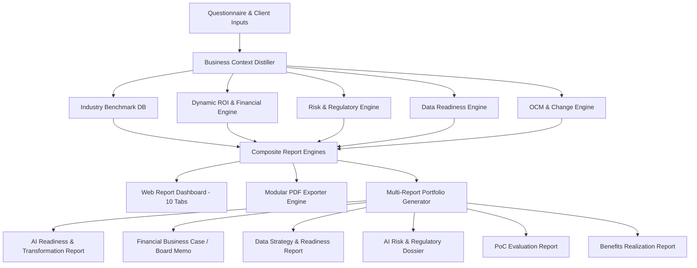

# Enterprise Report Enhancement & Multi-Report Consulting Portfolio Plan

## Executive Summary & Strategic Objectives

Following an exhaustive audit of:
1. `corrected_pdf_audit-need-to-work.md` (PDF report capabilities vs hardcoded fallbacks)
2. `report_gap_analysis--need-to-work.md` (Web UI report tabs vs Big-4 consulting standards)
3. `missing_report_types-need-to-work-on.md` (Full 14-report consulting lifecycle portfolio)

This implementation plan delivers a multi-phase roadmap to transform Nisol AI from a single-report assessment tool into an **Enterprise-Grade AI Advisory Platform**. 

The enhancements eliminate critical credibility risks (hardcoded numbers, static benchmarks, missing risk/data sections) and introduce the high-value consulting deliverables that justify ₹15L–₹50L+ ($20k–$100k+) enterprise advisory engagements.

---

## Architecture & System Overview

---

## User Review Required

> [!IMPORTANT]
> **Priority Execution Phasing**:
> - **Phase 1 (P0)**: Fix immediate credibility flaws (wire client numbers, industry benchmarks, sensitivity model, data & risk sections in PDF & UI).
> - **Phase 2 (P1)**: Enhance web report UX (bubble chart, prioritization ranking, OCM, roadmap Gantt, cover metadata).
> - **Phase 3 (P2)**: Expand into the Multi-Report Consulting Portfolio (Board Investment Memo, Dedicated Data Readiness, AI Risk Dossier, PoC Evaluation).
> - **Phase 4 (P3)**: Collaboration, version control, and client annotations.

---

## Detailed Proposed Changes by Component

---

### Component 1: Dynamic Financial Modeling & Industry Benchmarking (Phase 1 / P0)

Eliminate all hardcoded financial constants (`₹23.13 Crore`, `₹95 Lakhs`, `7.2 Months`, `62/85` benchmarks) and replace with deterministic, client-tailored math driven by questionnaire responses.

#### [NEW] [industryBenchmarks.ts](file:///e:/Nisol-Labs/Code/Anti-Gravity-Code/src/lib/report/industryBenchmarks.ts)
- Comprehensive industry benchmark database across 8 core sectors (BFSI, Healthcare, Manufacturing, Retail & E-commerce, IT & Software, Logistics & Supply Chain, Professional Services, Public Sector / Education).
- Benchmark metrics per industry:
  - Median AI Maturity Score (0–100) & Top Quartile Score (0–100)
  - Average AI Investment as % of Revenue
  - Average Payback Period (months)
  - Capability Dimension Breakdown (Strategy, Data, Talent, Governance, Tech, Operations)
  - Estimated Revenue Impact & Cost Takeout Benchmarks

#### [MODIFY] [analyticsEngine.ts](file:///e:/Nisol-Labs/Code/Anti-Gravity-Code/src/lib/report/analyticsEngine.ts)
- Update `computeFinancialROI` to accept `BusinessContextJSON` (headcount, revenue tier, manual hours, dept mix).
- Generate a 3-scenario Sensitivity Model:
  - **Base Case**: Planned adoption & cost curves.
  - **Conservative Case** (-20% adoption, +15% timeline/cost).
  - **Optimistic Case** (+20% adoption, accelerated deployment).
- Compute dynamic Net Present Value (NPV) at 10% discount rate and IRR (Internal Rate of Return).

#### [MODIFY] [pdfGenerator.ts](file:///e:/Nisol-Labs/Code/Anti-Gravity-Code/src/lib/utils/pdfGenerator.ts)
- Remove hardcoded constants on lines 51–55. Wire metrics directly from `report.roiAnalysis` and `report.industryBenchmarks`.
- Update `renderMaturityComparisonSVG` to use client's specific industry benchmarks.
- Add **Section 5.4: Sensitivity Analysis & Scenario Matrix** table in the PDF output.
- Add industry-specific use-case fallbacks based on sector instead of generic software QA/dev.

---

### Component 2: Risk Register & Data Readiness Deep-Dives (Phase 1 / P0)

#### [MODIFY] [governanceEngine.ts](file:///e:/Nisol-Labs/Code/Anti-Gravity-Code/src/lib/report/governanceEngine.ts)
- Expand to output a full **Enterprise Risk Register**:
  - Risk ID, Category (Regulatory, Data Privacy, Model Bias/Hallucination, Cyber/Prompt Injection, Operational, Vendor Lock-in).
  - Likelihood (1–5), Impact (1–5), Risk Score (1–25), Risk Level (Low/Medium/High/Critical).
  - Regulatory Mapping (India DPDP Act 2023, EU AI Act, GDPR, RBI/SEBI AI guidelines).
  - Mitigation Strategy, Accountability / Role Owner, Residual Risk Rating.

#### [MODIFY] [dataReadinessEngine.ts](file:///e:/Nisol-Labs/Code/Anti-Gravity-Code/src/lib/report/dataReadinessEngine.ts)
- Add 5-dimension Data Quality Scorecard (Completeness, Accuracy, Timeliness, Consistency, Accessibility).
- Data Architecture Blueprint recommendations (Vector Lakehouse, ETL, Metadata/MDM).
- Estimated Data Preparation Cost breakdown (typically 40–60% of total implementation).

#### [MODIFY] [pdfGenerator.ts](file:///e:/Nisol-Labs/Code/Anti-Gravity-Code/src/lib/utils/pdfGenerator.ts)
- Add dedicated **Section 2.5: Enterprise AI Risk & Regulatory Register** (with 5x5 Risk Heatmap).
- Add dedicated **Section 2.6: Data Readiness & Architecture Pre-requisites Assessment**.

---

### Component 3: Web Dashboard Expansion & UI Polish (Phase 2 / P1)

Bring the Web UI to parity with the enterprise PDF and consulting expectations.

#### [NEW] [RiskTab Component](file:///e:/Nisol-Labs/Code/Anti-Gravity-Code/src/components/intelligence/report/sections/RiskTab/index.tsx)
- Interactive 5×5 Likelihood vs Impact Risk Matrix grid.
- Sortable Risk Register table with filters by regulatory body and severity.
- Mitigation action tracker.

#### [NEW] [DataReadinessTab Component](file:///e:/Nisol-Labs/Code/Anti-Gravity-Code/src/components/intelligence/report/sections/DataReadinessTab/index.tsx)
- Data Quality Scorecard per domain (Customer Data, ERP/Financials, Operational Logs, Documents).
- Data Architecture readiness radar.
- Pre-requisite checklist before scaling use cases.

#### [NEW] [OCMTab Component](file:///e:/Nisol-Labs/Code/Anti-Gravity-Code/src/components/intelligence/report/sections/OCMTab/index.tsx)
- Organizational Change Management (OCM) framework.
- Stakeholder Impact Analysis (Leadership, Middle Management, Frontline Staff).
- RACI Matrix for AI initiatives.
- Role-based Upskilling & Training curriculum (AI Champions, End-users, Devs).

#### [MODIFY] [ReportTabs.tsx](file:///e:/Nisol-Labs/Code/Anti-Gravity-Code/src/components/intelligence/ReportTabs.tsx)
- Expand tabs from 8 to 11 to include:
  1. Executive Summary
  2. Readiness & Benchmarks
  3. Risk & Governance
  4. Data Readiness
  5. Opportunity Matrix
  6. Top 20 Use Cases
  7. Transformation Roadmap
  8. Change Management (OCM)
  9. ROI & Financial Model
  10. Solution Blueprints
  11. Proposal & Commercials

#### [MODIFY] [OpportunityMatrix.tsx](file:///e:/Nisol-Labs/Code/Anti-Gravity-Code/src/components/intelligence/report/sections/MatrixTab/index.tsx)
- Upgrade from static cards to an interactive 2D Bubble Chart (Feasibility vs. Business Value, sized by ROI \$) with tooltips and department filters.

#### [MODIFY] [UseCasesTab](file:///e:/Nisol-Labs/Code/Anti-Gravity-Code/src/components/intelligence/report/sections/UseCasesTab/index.tsx)
- Add **Prioritization Scoring Table** with sortable multi-criteria columns (Strategic Fit, ROI, Feasibility, Data Readiness, Risk Score, Composite Priority #).

#### [MODIFY] [ROITab](file:///e:/Nisol-Labs/Code/Anti-Gravity-Code/src/components/intelligence/report/sections/ROITab/index.tsx)
- Add 5-Year Cumulative Cash Flow Bar/Line Chart, NPV indicator, and Sensitivity Scenario Toggle (Base / Conservative / Optimistic).

---

### Component 4: Multi-Report Consulting Portfolio Architecture (Phase 3 / P2)

Expand Nisol AI into a multi-report system capable of generating specialized advisory deliverables across the consulting engagement lifecycle.

#### [NEW] [reportTypes.ts](file:///e:/Nisol-Labs/Code/Anti-Gravity-Code/src/lib/report/reportPortfolioTypes.ts)
- Report portfolio registry defining 6 specialized deliverables:
  1. `ai_readiness_transformation` (Flagship 30+ page Assessment)
  2. `board_investment_memo` (CFO / Board Financial Business Case, 10–12 pages)
  3. `data_readiness_strategy` (CTO / Data Engineering Blueprint, 15 pages)
  4. `ai_risk_regulatory_dossier` (Chief Risk Officer / Legal Compliance, 15 pages)
  5. `poc_evaluation_scalability` (PoC Outcomes & Go/No-Go Recommendation, 10 pages)
  6. `benefits_realization_review` (6–12 Month Post-Implementation Audit, 12 pages)

#### [NEW] [boardMemoGenerator.ts](file:///e:/Nisol-Labs/Code/Anti-Gravity-Code/src/lib/utils/boardMemoGenerator.ts)
- Specialized generator for Board / CFO investment decks:
  - 1-page Executive Investment Teaser.
  - Strategic Urgency & Competitive Risk ("Cost of Inaction").
  - 5-Year P&L Impact, NPV, IRR, Payback, and Phased Capital Allocation.
  - Decision Gate Criteria & Board Resolution sign-off.

#### [NEW] [dataStrategyGenerator.ts](file:///e:/Nisol-Labs/Code/Anti-Gravity-Code/src/lib/utils/dataStrategyGenerator.ts)
- Specialized technical blueprint for enterprise data architects.

#### [MODIFY] [app/(portal)/intelligence/audits/[id]/report/page.tsx](file:///e:/Nisol-Labs/Code/Anti-Gravity-Code/src/app/(portal)/intelligence/audits/[id]/report/page.tsx)
- Add a **Report Type Selector** modal allowing consultants to preview and export any of the 6 deliverables from a single audit dataset.

---

## Verification & Testing Plan

### Automated Tests & Quality Checks
1. **Financial Formula Accuracy**: Unit tests verifying that `calculateROICalculations` and `computeFinancialROI` compute correct payback, 5-year totals, and sensitivity cases without floating-point errors.
2. **Benchmark Resolution**: Test industry benchmark lookups across all 8 sectors to ensure valid non-zero median, quartile, and gap metrics.
3. **PDF Generation Rendering**: Script-driven validation ensuring all SVGs (Radar, Heatmap, Matrix, ROI Chart, Risk Matrix) render valid XML and HTML without overflow or broken markup.
4. **TypeScript Build & Lint**: `npm run build` / `npx tsc --noEmit` to verify type safety across all newly introduced engines and components.

### Manual Verification Workflows
1. **Audit to Report Flow**: Generate a report for a test tenant (e.g. Healthcare, Manufacturing, BFSI) and verify that:
   - All financial numbers reflect client size/inputs.
   - Benchmark comparisons display sector-specific curves (not 62/85).
   - Use cases and fallback blueprints match the industry domain.
   - Sensitivity table reflects Base vs Conservative vs Optimistic scenarios.
2. **PDF Export Inspection**: Export full PDF with all sections toggled on and verify cover page, TOC, page numbering, headers, and watermark across 30+ pages.
3. **Multi-Report Preview**: Switch between Flagship Report, Board Memo, and Risk Dossier to verify correct thematic framing for each audience (Board, CTO, CRO).
